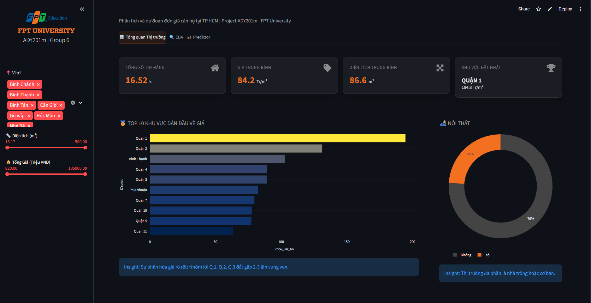

# 🏙️ HCMC Apartment Price Prediction (Dự đoán giá căn hộ tại TP.HCM)

[](https://www.python.org/)
[](https://scikit-learn.org/)
[](https://xgboost.readthedocs.io/)
[](https://streamlit.io/)



Đây là kho mã nguồn chính thức của đồ án **"Phân tích và dự đoán đơn giá căn hộ tại TP.HCM bằng các mô hình học máy"**. Dự án xây dựng một đường ống dữ liệu (Data Pipeline) hoàn chỉnh từ khâu thu thập dữ liệu tự động (Web Scraping), tiền xử lý, phân tích khám phá (EDA), cho đến huấn luyện mô hình học máy và triển khai ứng dụng trực quan (Interactive Dashboard).

---

## 🎯 Mục tiêu dự án
* Thu thập và làm sạch dữ liệu thực tế từ thị trường bất động sản trực tuyến (Batdongsan.com.vn).
* Phân tích các yếu tố ảnh hưởng đến đơn giá căn hộ tại TP.HCM (Vị trí, Diện tích, Nội thất).
* Đánh giá và so sánh 10 thuật toán học máy (Linear Models, KNN, SVM, Tree-based Ensembles).
* Xây dựng mô hình dự báo tối ưu và giải thích mức độ đóng góp của từng đặc trưng bằng Explainable AI (Permutation Importance).
* Triển khai hệ thống phân tích định giá tự động (Digital Twin) giao diện web.

---

## 📂 Cấu trúc Kho lưu trữ (Repository Structure)

Dự án được tổ chức theo tiêu chuẩn khoa học dữ liệu hiện đại:

```text
ADY304m_Project_HCMC_Apartment/
│
├── .gitignore                      # Cấu hình ẩn file rác
├── README.md                       # Tài liệu dự án
├── requirements.txt                # Danh sách thư viện (streamlit, plotly, scikit-learn...)
│
├── data/                           # Thư mục chứa dữ liệu
│   ├── raw.csv                     # Dữ liệu cào thô
│   ├── stage1_clean_full.csv       # Dữ liệu sạch lần 1 (Xử lý Python)
│   └── stage2_final.csv            # Dữ liệu sạch lần 2 (Dùng để train model)
│
├── scripts/                        # Mã nguồn xử lý dữ liệu & ML
│   ├── 01_scraper.py               # Code cào dữ liệu bằng Selenium
│   ├── 02_data_cleaning.py         # Code làm sạch, xử lý chuỗi
│   ├── 03_eda_analysis.py          # Code phân tích khám phá (EDA)
│   ├── 04_model_training.py        # Pipeline train & đánh giá 10 models
│   └── 05_permutation_importance.py# Code giải thích mô hình AI
│
├── sql/                            # Truy vấn cơ sở dữ liệu
│   └── 01_outlier_removal.sql      # Xóa dữ liệu ngoại lai
│
├── dashboards/                     # Ứng dụng Web
│   ├── app.py                      # Mã nguồn giao diện Streamlit
│   └── Dashboards.png              # Hình ảnh minh họa
│
└── outputs/                        # Kết quả trả về từ Machine Learning
    ├── metadata/
    │   └── experiment_summary.json 
    ├── models/
    │   └── best_model.pkl          # File model đã huấn luyện
    └── tables/
        ├── best_model_top10_details.csv                 
        ├── model_comparison_results.csv                 
        ├── ols_top_coefficients_for_paper.csv           
        └── random_forest_permutation_importance_top10.csv
